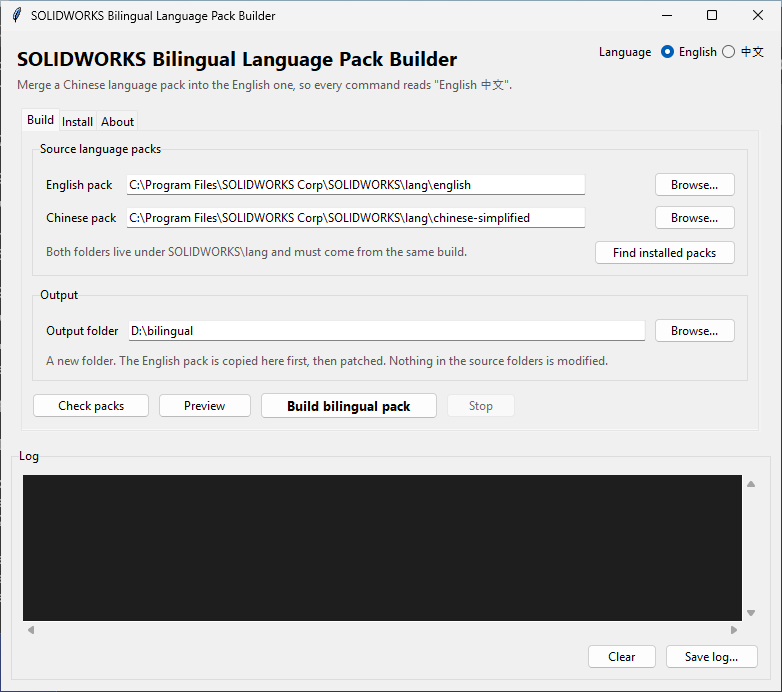
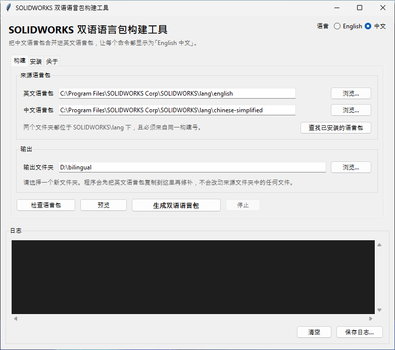

# SOLIDWORKS Bilingual Language Pack Builder

Turn the English SOLIDWORKS interface into a bilingual one, where every command
reads **`English 中文`**.

SOLIDWORKS keeps loading its English language pack and needs no configuration
change. The pack itself is rewritten so each short label is followed by its
Chinese translation, taken from the official Chinese pack of the same build.

[](#requirements)
[](#requirements)
[](#requirements)
[](LICENSE)

[中文说明](README.zh-CN.md)



---

## What it produces

Real entries from a pack built with this tool (SOLIDWORKS 2025 SP0, build
33.0.0.5050):

```
Extruded Boss/Base 拉伸凸台/基体
Extruded Cut 拉伸切除
Fillet 圆角
Chai&n fillet faces 链锁圆角面
Surface / Solid Bodies 曲面/实体
Remove Dimension Breaks 移除尺寸断裂
Select entities to fit the new spline to. 选择将新样条曲线所套合到的实体。
```

On that build the result contains **25,022 bilingual string entries across 53
resource DLLs**, plus dialog captions and PropertyManager text.

Long messages, format strings, file paths and internal registration entries are
deliberately left in English — see [Merge rules](#merge-rules).

## Requirements

| | |
|---|---|
| Operating system | Windows (building and installing use the Windows resource API) |
| Python | 3.8 or newer, only if you run from source |
| Dependencies | None. Standard library only |
| SOLIDWORKS | A licensed installation, with the English and Chinese packs of the **same build** |

The `check`, `preview` and `locate` commands also run on macOS and Linux, so a
pair of packs can be inspected before doing anything on the Windows machine.

## Quick start

### Option 1 — the desktop application

Download `SWBilingual.exe` from the [releases page](../../releases). Nothing
needs to be installed.

Every release is built on a clean Windows machine by
[GitHub Actions](.github/workflows/release.yml) from the tagged commit, checked
by the test suite, started once to confirm it runs, and published with a
`SHA256SUMS.txt` to verify the download against. To build it yourself instead,
run [`build\build-exe.bat`](build/build-exe.bat).

1. **Build tab** — choose the English pack, the Chinese pack and an output folder.
2. **Check packs** confirms both are the same build.
3. **Preview** shows what the merged labels will look like, without writing anything.
4. **Build bilingual pack** copies the English pack to the output folder, patches
   it, and verifies the result.
5. **Install tab** — back up the pack SOLIDWORKS is using and replace it.

The interface is available in English and Chinese; switch with the selector in
the top-right corner.



Both pictures are captured automatically on a Windows runner by the
[interface job](.github/workflows/tests.yml), so they always show the current
build rather than an old mock-up.

### Option 2 — from source

```
git clone https://github.com/StarryGuli/solidworks-bilingual.git
cd solidworks-bilingual
run-gui.bat
```

### Option 3 — the command line

```
python swbilingual-cli.py check   D:\en D:\cn
python swbilingual-cli.py preview D:\en D:\cn -t Fillet
python swbilingual-cli.py build   D:\en D:\cn D:\out
python swbilingual-cli.py install D:\out "C:\Program Files\SOLIDWORKS Corp\SOLIDWORKS\lang\english"
```

Add `--lang zh` for Chinese output. Every command is described in
[`docs/command-line.md`](docs/command-line.md).

## Try it without SOLIDWORKS

The repository carries a small generated pair of packs, so the tool can be run
on any operating system before you touch a real installation:

```
python swbilingual-cli.py check   samples/english samples/chinese
python swbilingual-cli.py preview samples/english samples/chinese
```

```
Examined 1 files, 20 matched string pairs, 15 would become bilingual.
----------------------------------------------------------
Extrude Shape 拉伸形体
Round Edge 圆化边线
Measure Distance 测量距离
&Save Copy 保存副本
```

Those labels belong to an imaginary modelling program and were written for this
project; nothing in the sample comes from SOLIDWORKS. Five of the twenty entries
are deliberately unmergeable — a format string, a file filter, a URL, a long
sentence and an untranslated label — so the preview shows the filtering too.

## Finding the two language packs

Both live under the SOLIDWORKS installation:

```
C:\Program Files\SOLIDWORKS Corp\SOLIDWORKS\lang\english
C:\Program Files\SOLIDWORKS Corp\SOLIDWORKS\lang\chinese-simplified
```

`swbilingual-cli.py locate`, and **Find installed packs** in the application,
list the folders present on the machine with their build numbers. The
installation is located through the registry, so it is found on any drive.

SOLIDWORKS offers *Chinese* and *Chinese Simplified* as separate languages, and
installations disagree about which folder holds which — a folder named `chinese`
is Traditional on some machines and Simplified on others. The tool reads the
pack and tells you which script it contains rather than guessing from the name.

English is always installed; the Chinese pack usually has to be added, through
the SOLIDWORKS Installation Manager so that it matches your build.
**[Getting the two language packs](docs/getting-the-language-packs.md)** walks
through it step by step, and covers downloading the media manually and the
Simplified versus Traditional trap.

This repository does not distribute language packs. They are Dassault Systèmes
software and come from your own licensed installation.

> **The build numbers must match.** Resource identifiers are assigned per build,
> so merging packs from different builds pairs unrelated strings. The tool reads
> the version from `sldresu.dll` in both folders and refuses to continue when
> they differ.

## How it works

The merge runs in three passes, each handling a different place SOLIDWORKS keeps
its interface text:

| Pass | Resource | What it covers |
|---|---|---|
| 1 | String tables | Command names, menu entries, tooltips, status-bar prompts |
| 2 | Dialog templates | Window titles, buttons, static labels. Controls are widened when the longer text needs room |
| 3 | XAML dictionaries | PropertyManager text in `DveDictionary.xaml` and `pmdictionary.xaml` |

Three checks then run against the result: every resource present in the original
must still be present, no dialog control may newly overlap another or cross the
dialog border, and every patched DLL must load through the real Windows loader.

[`docs/how-it-works.md`](docs/how-it-works.md) describes each pass in detail.

## Merge rules

A label only gets a Chinese twin when all of these hold:

- Both sides are non-empty and different from each other
- The Chinese side actually contains Chinese characters
- The English side is at most 60 characters, the Chinese side at most 40
- Neither side contains `%` — format strings are assembled at run time
- Neither side contains a tab or carriage return
- The English side is not a path, file filter or URL
- The English side contains at least one Latin letter

Toolbar entries are stored as two segments, `description` and `command name`,
separated by a newline. Each segment is judged separately, so the short command
name becomes bilingual while the long description stays in English.

Everything else is copied through untouched. The limits live in `MAX_EN` and
`MAX_CN` in [`src/swbilingual.py`](src/swbilingual.py).

## Installing and undoing

`install` copies the built pack over the folder SOLIDWORKS uses, after copying
the current folder to `english.backup-YYYYmmdd-HHMMSS` next to it. `restore`
puts a backup back.

Close SOLIDWORKS first, and run the tool as administrator — the installation
folder is not writable otherwise.

## Known limitations

- **Windows only** for building and installing. The Windows resource API is the
  only supported way to write resources back into a PE file.
- **Digital signatures are invalidated.** Editing resources breaks the
  signature on each patched DLL. SOLIDWORKS does not check language-pack
  signatures, but security software occasionally takes an interest.
- **Long messages stay in English** by design. Translating them would double the
  length of every error dialog.
- **A few labels keep an empty bracket**, for example `从组中移除()`, where the
  Chinese original placed the accelerator marker in brackets and the marker was
  removed. This affects 16 of 25,033 merged entries on the reference build.
- **Dialogs that cannot be re-encoded byte for byte are skipped** rather than
  risking a corrupt template.

## Rebuilding after a SOLIDWORKS update

An update replaces the language pack, and with it the bilingual one. Run the
build again with the new English and Chinese packs; nothing else changes.

## Legal notice

This project contains no SOLIDWORKS files. It is a tool that operates on the
language packs already present in a licensed installation.

SOLIDWORKS is a registered trademark of Dassault Systèmes. Language packs and
their translations are the property of Dassault Systèmes and must not be
redistributed, whether in original or in merged form. This project is not
affiliated with, endorsed by, or supported by Dassault Systèmes. Modifying an
installation may affect your support arrangements; keep the backup the installer
creates.

## Documentation

| | |
|---|---|
| [Getting the two language packs](docs/getting-the-language-packs.md) | Adding the Chinese pack, official downloads, matching build numbers |
| [How it works](docs/how-it-works.md) | What each pass does, and why the checks exist |
| [Command line reference](docs/command-line.md) | Every command and option |
| [Troubleshooting](docs/troubleshooting.md) | Refused builds, failed verification, undoing an installation |

## Contributing

Bug reports and pull requests are welcome — see [CONTRIBUTING.md](CONTRIBUTING.md).
The test suite runs on any operating system:

```
python -m unittest discover -s tests
```

Every push is tested on Windows and Linux against Python 3.8 and 3.12, and the
desktop interface is built and photographed on a Windows runner, so a change
that breaks either interface is caught before it is merged.

## License

[MIT](LICENSE) for the tooling in this repository. [NOTICE](NOTICE)
explains what the license does not cover.
