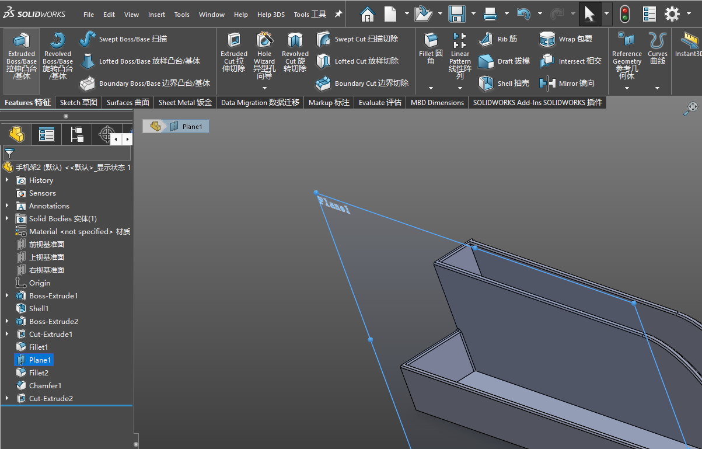
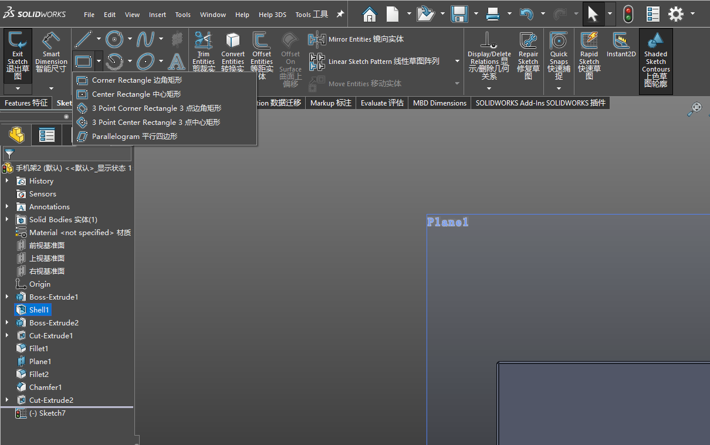
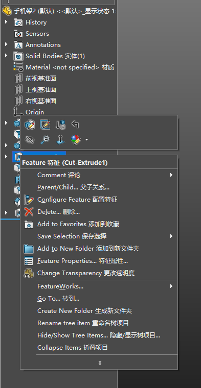
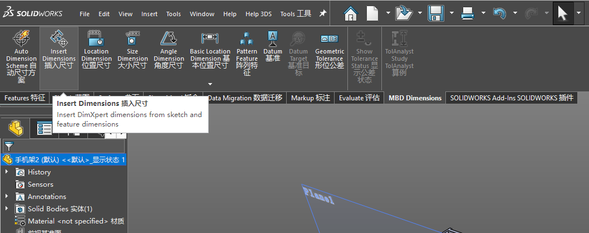
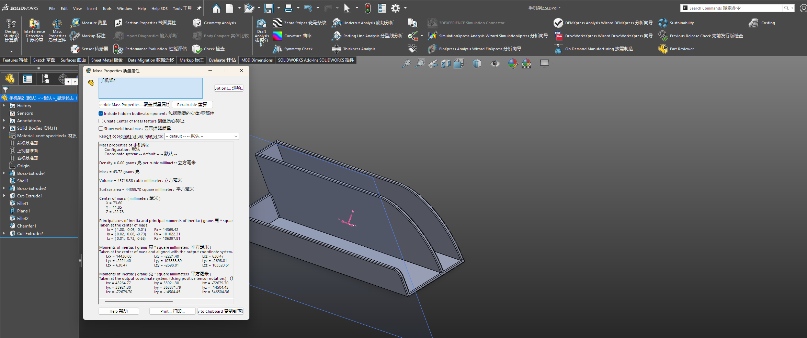

# SOLIDWORKS 双语语言包构建工具

把英文版 SOLIDWORKS 界面变成双语界面，每个命令都显示为 **`English 中文`**。

SOLIDWORKS 仍然加载它原来的英文语言包，不需要改动任何设置。工具改写的是语言包本身：
从同一构建号的官方中文包中取出译文，追加到英文短标签后面。

[](#运行环境)
[](#运行环境)
[](#运行环境)
[](LICENSE)

[English](README.md)


---

## 实际效果

下面是 SOLIDWORKS 2025 加载本工具生成的语言包后的实际界面截图。
功能区、特征树、菜单、提示和对话框都显示为 `English 中文`：



| | |
|---|---|
|  |  |
|  |  |

提示框正文里的英文说明是**特意保留**的：工具只合并短标签，长段说明保持原样，
读起来不会被打断。质量属性对话框则展示了一个需要知道的限制，见
[已知限制](#已知限制)。

同一个语言包里的真实条目（SOLIDWORKS 2025 SP0，构建 33.0.0.5050）：

```
Extruded Boss/Base 拉伸凸台/基体
Extruded Cut 拉伸切除
Fillet 圆角
Chai&n fillet faces 链锁圆角面
Surface / Solid Bodies 曲面/实体
Remove Dimension Breaks 移除尺寸断裂
Select entities to fit the new spline to. 选择将新样条曲线所套合到的实体。
```

在该构建上，成品包含 **53 个资源 DLL 中的 25,022 条双语字符串**，
另有对话框标题与 PropertyManager 文字。

长句、格式化字符串、文件路径和内部注册用条目会**刻意保持英文**，
原因见[合并规则](#合并规则)。

## 运行环境

| | |
|---|---|
| 操作系统 | Windows（构建与安装需要调用 Windows 资源 API） |
| Python | 3.8 或更高，仅在从源码运行时需要 |
| 第三方依赖 | 无，只用标准库 |
| SOLIDWORKS | 已获授权的安装，且英文包与中文包**构建号相同** |

`check`、`preview`、`locate` 三个命令在 macOS 和 Linux 上同样可用，
可以先在别的机器上把两个语言包检查清楚，再回到 Windows 上动手。

## 快速开始

### 方式一：桌面程序

从[发布页](../../releases)下载 `SWBilingual.exe`，目标机器无需安装任何东西。

每个发布版本都由 [GitHub Actions](.github/workflows/release.yml)
在干净的 Windows 环境中从对应 tag 构建：先跑测试套件，再启动一次确认能正常运行，
最后连同 `SHA256SUMS.txt` 一起发布，供你校验下载文件。
也可以用 [`build\build-exe.bat`](build/build-exe.bat) 自行打包。

1. **构建**页 —— 选择英文语言包、中文语言包和输出文件夹。
2. **检查语言包** —— 确认两者构建号一致。
3. **预览** —— 不写入任何文件，先看合并后的标签长什么样。
4. **生成双语语言包** —— 把英文包复制到输出文件夹，修补，然后自动校验。
5. **安装**页 —— 备份 SOLIDWORKS 正在使用的语言包并替换它。

界面提供中英两种语言，用右上角的选择器切换。


以上两张截图由 [interface 流水线](.github/workflows/tests.yml)
在 Windows runner 上自动截取，因此永远反映当前版本，而不是一张过时的效果图。

### 方式二：从源码运行

```
git clone https://github.com/StarryGuli/solidworks-bilingual.git
cd solidworks-bilingual
run-gui.bat
```

### 方式三：命令行

```
python swbilingual-cli.py --lang zh check   D:\en D:\cn
python swbilingual-cli.py --lang zh preview D:\en D:\cn -t Fillet
python swbilingual-cli.py --lang zh build   D:\en D:\cn D:\out
python swbilingual-cli.py --lang zh install D:\out "C:\Program Files\SOLIDWORKS Corp\SOLIDWORKS\lang\english"
```

各命令的完整说明见 [`docs/command-line.zh-CN.md`](docs/command-line.zh-CN.md)。

## 没有 SOLIDWORKS 也能先试

仓库里带了一小对生成出来的语言包，在动真实安装之前，任意操作系统上都能直接跑：

```
python swbilingual-cli.py --lang zh check   samples/english samples/chinese
python swbilingual-cli.py --lang zh preview samples/english samples/chinese
```

```
已检查 1 个文件，匹配字符串 20 对，其中 15 条将变为双语。
----------------------------------------------------------
Extrude Shape 拉伸形体
Round Edge 圆化边线
Measure Distance 测量距离
&Save Copy 保存副本
```

这些标签属于一个虚构的建模软件，是为本项目编写的，**没有任何内容来自 SOLIDWORKS**。
20 条里有 5 条是故意不可合并的——格式化字符串、文件过滤器、URL、长句、未翻译项——
好让预览同时展示过滤行为。

## 两个语言包在哪里

都在 SOLIDWORKS 安装目录下：

```
C:\Program Files\SOLIDWORKS Corp\SOLIDWORKS\lang\english
C:\Program Files\SOLIDWORKS Corp\SOLIDWORKS\lang\chinese-simplified
```

运行 `swbilingual-cli.py locate`，或点桌面程序里的**查找已安装的语言包**，
即可列出本机已有的语言文件夹及其构建号。安装路径通过注册表定位，装在哪个盘都能找到。

SOLIDWORKS 把「中文」和「简体中文」作为两个独立语言提供，
而不同机器上这两个文件夹的对应关系并不一致——名为 `chinese` 的文件夹，
有的机器上是繁体，有的是简体。本工具会直接读取包内容判断简繁，不靠文件夹名猜。

英文包一定有；中文包通常需要另外添加，并且要通过 SOLIDWORKS 安装管理程序添加，
才能保证与你的构建号一致。
**[获取两个语言包](docs/getting-the-language-packs.zh-CN.md)** 里有分步图解式说明，
并覆盖了手动下载安装介质、以及简体/繁体装错这个坑。

本仓库不分发语言包。语言包是 Dassault Systèmes 的软件，
只能来自你自己已获授权的安装。

> **构建号必须一致。** 资源 ID 是按构建分配的，
> 拿不同构建的两个包去合并，会把毫不相干的字符串配成一对。
> 工具会读取两侧 `sldresu.dll` 的版本号，不一致时直接拒绝继续。

## 工作原理

SOLIDWORKS 的界面文字分散在三处，因此合并分三步进行：

| 步骤 | 资源类型 | 覆盖内容 |
|---|---|---|
| 1 | 字符串表 | 命令名、菜单项、工具提示、状态栏提示 |
| 2 | 对话框模板 | 窗口标题、按钮、静态文本；文字变长时会按需加宽控件 |
| 3 | XAML 字典 | `DveDictionary.xaml` 与 `pmdictionary.xaml` 中的 PropertyManager 文字 |

随后对成品执行三项检查：原包中的每一项资源都必须仍然存在；
任何对话框控件不得新产生重叠或越出对话框边界；每个被修补的 DLL 都必须能被真正的
Windows 加载器加载。

每一步的细节见 [`docs/how-it-works.zh-CN.md`](docs/how-it-works.zh-CN.md)。

## 合并规则

只有同时满足下列条件的标签才会被加上中文：

- 两侧都非空，且互不相同
- 中文侧确实含有汉字
- 英文侧不超过 60 个字符，中文侧不超过 40 个字符
- 两侧都不含 `%` —— 格式化字符串是运行时拼接的
- 两侧都不含制表符或回车
- 英文侧不是路径、文件过滤器或 URL
- 英文侧至少含有一个拉丁字母

工具栏条目以「说明 + 命令名」两段存储，中间用换行分隔。两段各自单独判断，
因此短的命令名会变成双语，而长的说明保持英文。

其余内容一律原样复制。长度上限定义在
[`src/swbilingual.py`](src/swbilingual.py) 的 `MAX_EN` 与 `MAX_CN`。

## 安装与还原

`install` 会先把当前语言文件夹复制为同级的 `english.backup-YYYYmmdd-HHMMSS`，
再把生成的双语包覆盖上去；`restore` 用来把备份还原回原位。

操作前请关闭 SOLIDWORKS，并以管理员身份运行，否则安装目录不可写。

## 已知限制

- **构建与安装仅限 Windows。** 把资源写回 PE 文件，只有 Windows 资源 API 这一条受支持的路径。
- **数字签名会失效。** 改写资源会破坏每个被修补 DLL 的签名。
  SOLIDWORKS 不校验语言包签名，但安全软件偶尔会对此产生兴趣。
- **长句刻意保持英文。** 否则每个错误对话框的长度都会翻倍。
- **少数标签会残留一对空括号**，例如 `从组中移除()` ——
  中文原文把快捷键标记写在括号里，标记被移除后括号留了下来。
  在参考构建上，这种情况占 25,033 条合并条目中的 16 条。
- **无法逐字节还原的对话框会被跳过**，而不是冒险写出一个损坏的模板。
- **固定尺寸对话框里的部分标题会被截断。** 控件只会向空白处加宽，
  对话框里没有空位时，变长的双语标题就在边缘被截掉。上图质量属性对话框里的
  `Options...`、`Override Mass Properties...`、`Copy to Clipboard`
  都少了几个字符。对话框仍可正常使用，被截掉的是中文或英文的末尾。
  如果某个对话框影响到你，欢迎反馈它的名称。

## SOLIDWORKS 升级后

升级会替换语言包，双语包也随之消失。用新的英文包和中文包重新构建一次即可，
其余步骤不变。

## 法律声明

本项目不包含任何 SOLIDWORKS 文件，它只是一个对已授权安装中现有语言包进行处理的工具。

SOLIDWORKS 是 Dassault Systèmes 的注册商标。语言包及其译文的版权归 Dassault Systèmes 所有，
无论原始形式还是合并后的形式，都不得再分发。本项目与 Dassault Systèmes 无任何隶属、
认可或支持关系。修改安装内容可能影响你的技术支持权益，请保留工具创建的备份。

## 文档

| | |
|---|---|
| [获取两个语言包](docs/getting-the-language-packs.zh-CN.md) | 如何添加中文包、官方下载渠道、构建号如何对上 |
| [工作原理](docs/how-it-works.zh-CN.md) | 每一步做了什么，以及三项检查为什么存在 |
| [命令行参考](docs/command-line.zh-CN.md) | 全部命令与选项 |
| [常见问题](docs/troubleshooting.zh-CN.md) | 构建被拒、校验失败、如何撤销安装 |

## 参与贡献

欢迎提交问题报告和 Pull Request，详见 [CONTRIBUTING.md](CONTRIBUTING.md)。
测试套件在任意操作系统上都能运行：

```
python -m unittest discover -s tests
```

每次推送都会在 Windows 和 Linux 上分别用 Python 3.8 与 3.12 测试，
并在 Windows runner 上构建桌面界面并截图存档，
因此任何一侧界面被改坏都能在合并前发现。

## 许可证

本仓库中的工具代码采用 [MIT](LICENSE) 许可证。[NOTICE](NOTICE) 说明了该许可证不涵盖的内容。
